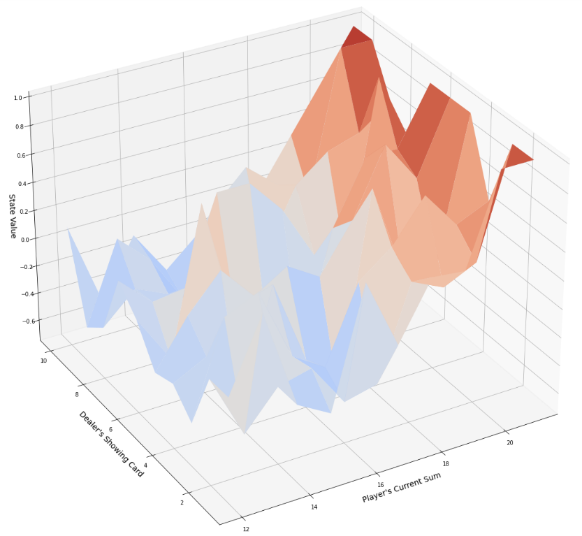

# Solutions for Simple21 exercise of David Silver`s lectures
You can find the lectures and the description of the exercise under _https://www.davidsilver.uk/teaching/_  

### Action Value tables visualization:

| Monte Carlo | Sarsa(λ) | Sarsa(λ) - AV approximation |
| :---         |     :---:      |          ---: |
|    |     |     |
